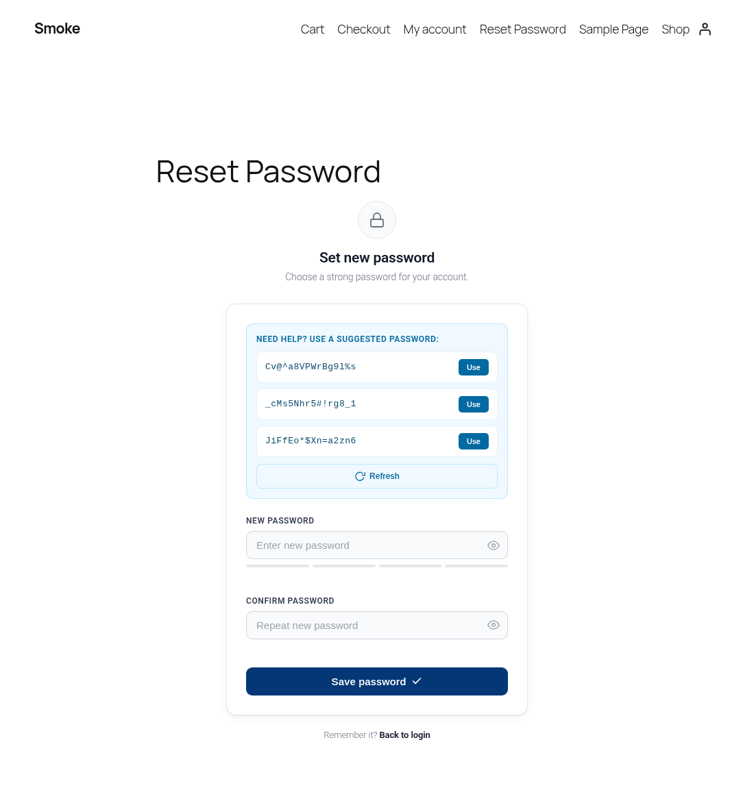
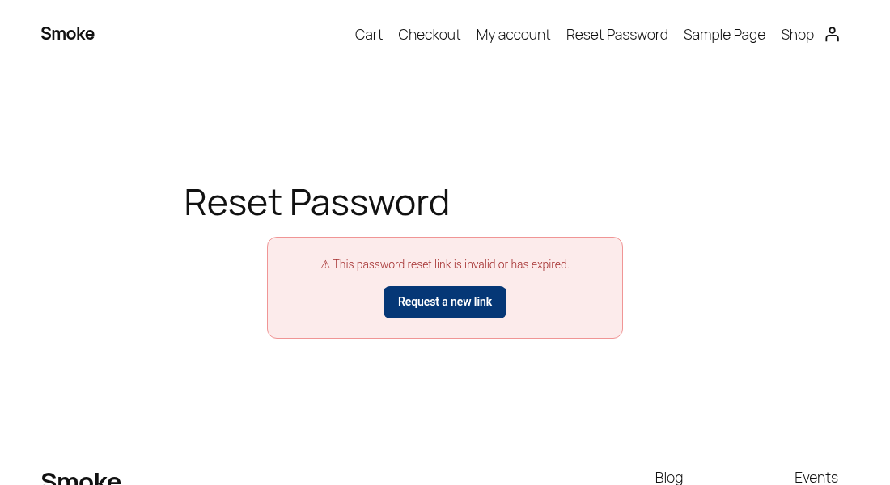

- Website: [hubstafftalent.net/profiles/lawrance-babu](https://hubstafftalent.net/profiles/lawrance-babu)# Custom Reset Password Page

A WordPress plugin that replaces the default `wp-login.php` password reset screen with a styled, on-brand front-end page, complete with a strength meter and secure password suggestions.




## Features

- **Seamless redirect**: password reset links from WordPress (and front-end URLs carrying reset parameters) land on your own page instead of `wp-login.php`.
- **Shortcode based**: `[custom_reset_password_form]` renders the form on any page, so it inherits your theme.
- **Auto setup**: activation reuses an existing `/reset-password/` page or creates one with the shortcode.
- **Password suggestions**: three strong 16-character passwords generated in the browser with `crypto.getRandomValues()`, one click to use.
- **Live feedback**: four-step strength meter, match indicator and show / hide toggles.
- **AJAX submit** with inline success and error messages, then a redirect to a configurable URL.
- **Graceful fallback**: if no reset page is published, the default WordPress screen is used.
- **Works for logged-in users** as well as guests.
- **Settings screen** for the reset page, redirect URL, "Back to login" link, button color and minimum password length.
- **Translation ready** with a bundled `.pot` file.

## Screenshots

| Reset form | Expired or invalid link |
|------------|-------------------------|
|  |  |

## Installation

1. Download the latest release zip (or clone this repository into `wp-content/plugins/`).
2. In WordPress admin, go to **Plugins > Add New > Upload Plugin** and upload the zip.
3. Activate **Custom Reset Password Page**. A "Reset Password" page is created (or reused) automatically.

```bash
cd wp-content/plugins
git clone https://github.com/lawrancebabu/custom-reset-password.git
```

Tip: block themes list new pages in the navigation automatically. Remove the "Reset Password" page from your menu if you do not want it there.

## Configuration

Go to **Settings > Reset Password Page**:

| Setting                 | Description                                                        | Default                 |
|-------------------------|--------------------------------------------------------------------|-------------------------|
| Reset page              | Page containing `[custom_reset_password_form]`. "None" disables the redirect. | Page created on activation |
| Redirect after success  | Where users go after saving a new password. Must be on this site.  | Homepage                |
| "Back to login" link    | Target of the link under the form.                                 | Homepage                |
| Button color            | Hex color for the submit and "Request a new link" buttons.         | `#053776`               |
| Minimum password length | Enforced in the browser and on the server (6 to 64).               | `8`                     |

Settings are stored in a single option, `crp_options`.

## How It Works

1. A user requests a reset and clicks the emailed link (`wp-login.php?action=rp&key=...&login=...`).
2. On `login_form_rp` / `login_form_resetpass` the plugin stores the credentials in WordPress core's own `wp-resetpass-{COOKIEHASH}` cookie (HttpOnly, Secure on HTTPS) and redirects to the reset page.
3. The shortcode validates the key with `check_password_reset_key()` and renders either the form or an "invalid or expired" message with a link to request a new one.
4. The form posts to `admin-ajax.php`. The handler verifies the nonce, validates the passwords, re-validates the key, fires core's `validate_password_reset` action (so password policy plugins still apply), then calls `reset_password()` and clears the cookie.

### Hooks used

| Hook | Type | Purpose |
|------|------|---------|
| `login_form_rp`, `login_form_resetpass` | action | Redirect core reset links to the custom page. |
| `template_redirect` | action | Redirect front-end URLs with reset parameters; send no-cache and `Referrer-Policy: no-referrer` headers on the reset page. |
| `wp_enqueue_scripts` | action | Register assets, enqueue them only where the form is used. |
| `wp_ajax_crp_reset_password`, `wp_ajax_nopriv_crp_reset_password` | action | AJAX password reset. |
| `validate_password_reset` | action (fired) | Lets other plugins add password rules, same as `wp-login.php`. |
| `admin_menu`, `admin_init` | action | Settings page and Settings API registration. |
| `init` | action | Loads translations. |
| `register_activation_hook` | activation | Creates or reuses the reset page. |

### Security measures

- `ABSPATH` direct-access guard; `WP_UNINSTALL_PLUGIN` guard on `uninstall.php`.
- The reset key is always validated server-side with core's `check_password_reset_key()`; keys are single-use.
- Nonce verification on the AJAX request.
- Passwords are unslashed but otherwise passed to core untouched, so special characters work as typed.
- Reset page is sent with no-cache headers and `Referrer-Policy: no-referrer` so the key in the URL is not cached or leaked to third-party resources.
- Post-reset redirect is limited to allowed hosts with `wp_validate_redirect()`.
- Password suggestions use the Web Crypto API with rejection sampling and a Fisher-Yates shuffle (no `Math.random()`).
- Input sanitized with `sanitize_user`, `sanitize_text_field`, `absint`, `esc_url_raw` and `sanitize_hex_color`; output escaped with `esc_html`, `esc_attr`, `esc_url` and `wp_kses`.
- Code checked with PHP_CodeSniffer using WordPress Coding Standards and PHPCompatibilityWP (`phpcs.xml.dist`).

## Uninstall

Deleting the plugin removes the `crp_options` setting. The reset page is regular site content and is left in place.

## Development

```bash
composer global require wp-coding-standards/wpcs phpcompatibility/phpcompatibility-wp
phpcs            # uses phpcs.xml.dist
wp i18n make-pot . languages/custom-reset-password.pot --exclude=screenshots
```

## Requirements

- WordPress 6.0 or later
- PHP 7.4 or later

## File Structure

```
custom-reset-password/
├── custom-reset-password.php     # Main plugin file (redirects, shortcode, AJAX handler, settings)
├── uninstall.php                 # Removes plugin settings on uninstall
├── assets/
│   ├── crp.css                   # Form styles
│   └── crp.js                    # Strength meter, suggestions, show / hide, AJAX submit
├── languages/
│   └── custom-reset-password.pot # Translation template
├── screenshots/
│   ├── reset-form.png
│   └── invalid-link.png
├── phpcs.xml.dist                # Coding standards config
├── readme.txt                    # WordPress.org-style readme
├── README.md
├── LICENSE
└── .gitignore
```

## License

GPL-2.0-or-later. See [LICENSE](LICENSE).

## Author

**Lawrance Babu Gain**, Senior PHP / WordPress / Laravel Developer

- GitHub: [@lawrancebabu](https://github.com/lawrancebabu)
- Website: [topshelfpeptide.com](https://topshelfpeptide.com)
- Email: [lawrance1020@gmail.com](mailto:lawrance1020@gmail.com)
